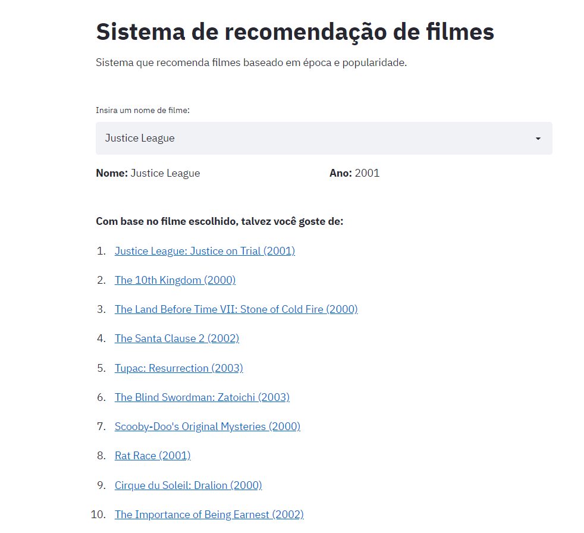

# Sistema de recomendação de filmes baseado em época e popularidade (com aplicação)

## Introdução
Na era em que se vive hoje, com um mundo extremamente conectado via Internet, o grande volume de informações disponibilizadas na internet não é novidade para ninguém. Entretanto, mesmo que o usuário se acostume com isso, ele tem cada vez mais dificuldade em escolher por conta qual conteúdo consumir, visto que está sempre mergulhado nas mais diversas opções.

Uma plataforma de filmes com os mais diferentes títulos disponíveis, uma loja com os mais diversos tipos de produtos à venda ou um site de informação com uma enorme quantidade de notícias dos mais diferentes assuntos, todos esses contextos **disponibilizam ao usuário muitas opções para acesso e consumo**. Porém, todo esse **mar de informação pode causar dúvida** para o indivíduo: *o que escolho para consumir?*

E é nesse momento em que os sistemas de recomendação ganham cada vez mais força. Um sistema de recomendação tenta oferecer a determinado usuário algo que possivelmente possa interessá-lo a partir de um grande volume de informações sobre o respectivo usuário ou produto.


## Desenvolvimento do projeto

### Dados utilizados

O intuito deste projeto é sobre criar um sistema de recomendação de filmes a partir dos dados fornecidos. De modo geral, temos acesso a duas bases de dados que estão localizadas na pasta 'Dados':


- Netflix_Dataset_Movie (filmes):

Coluna | Conteudo
-------|---------
Movie_ID | Id do filme
Year | Ano de lançamento do respectivo filme
Name |Nome completo (em inglês) do respectivo filme
    
    
- Netflix_Dataset_Rating (avaliações):

Coluna | Conteudo
-------|---------
User_ID | Id do usuário que fez a avaliação
Rating | Nota dada pelo usuário ao filme
Movie_ID | Id do filme avaliado


### Esquema de recomendação

A partir dos dados disponíveis, será criado um **sistema de recomendação baseado em produto** em que o usuário escolhe um filme e o sistema retorna opções que o mesmo julga interessantes para este respectivo usuário em questão.

O sistema criado recomenda filmes com base na época do filme e popularidade sua respectiva popularidade. Época e popularidade são características que foram criadas no notebook [sistema-recomendacao](https://github.com/ViniPilan/recomm-system/blob/master/Notebooks/sistema-recomendacao.ipynb) para cada filme com base na análise dos dados disponíveis. O notebook citado se encontra na pasta 'Notebooks'

Vale ressaltar que, dessa forma, o sistema recomenda filmes de mesma época que tiveram popularidade parecida. A recomendação com base no gênero do filme não foi possível de ser criada pois não se tem essa informação (gênero de cada filme) na base de dados.


### Funcionamento da aplicação

Para rodar a aplicação, basta executar o seguinte comando dentro da pasta 'Aplicação':

```streamlit run app.py```




### Linguagem de programação e bibliotecas utilizadas

A linguagem utilizada para fazer esse projeto foi o Python e as bibliotecas foram:
- pandas
- numpy
- matplotlib
- seaborn
- pickle
- sklearn
- streamlit


## Sobre o autor do projeto

Me chamo Vinícius, sou fascinado pela ciência de dados e encontrei nessa área uma paixão. Busco aprender constantemente 
para alcançar autoridade como Cientista de Dados profissional e atingir este que é meu objetivo de carreira.

Estudo Ciência da Computação na UNESP Bauru (estou no último ano do curso, tenho horários bastante 
flexíveis) e venho estudando ciência de dados para conseguir me consolidar no mercado.

Já realizei cursos, adquiri certificações e desenvolvi alguns projetos que envolvem e misturam conceitos como Python, análise e visualização de dados, Machine Learning (classificação, regressão, otimização, 
agrupamento) e SQL.

Tenho um site pessoal que contém mais informações sobre mim, minhas principais certificações e projetos:
https://sites.google.com/view/vinicius-pilan/
